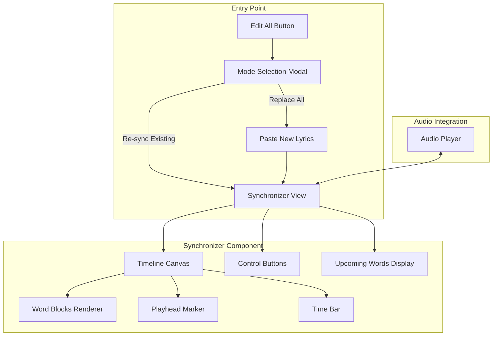

# MidiCo-Style Synchronizer Implementation

## Current State Analysis

The existing implementation in [`ReplaceAllLyricsModal.tsx`](lyrics_transcriber_temp/lyrics_transcriber/frontend/src/components/ReplaceAllLyricsModal.tsx) has two phases:

1. **Paste Phase** - User pastes new lyrics text
2. **Sync Phase** - Manual sync using spacebar with timeline view

Key existing components:

- [`useManualSync.ts`](lyrics_transcriber_temp/lyrics_transcriber/frontend/src/hooks/useManualSync.ts) - Spacebar handling, tap/hold detection
- [`EditTimelineSection.tsx`](lyrics_transcriber_temp/lyrics_transcriber/frontend/src/components/EditTimelineSection.tsx) - Timeline controls with zoom/scroll
- [`TimelineEditor.tsx`](lyrics_transcriber_temp/lyrics_transcriber/frontend/src/components/TimelineEditor.tsx) - Timeline rendering

**Problems with current implementation:**

1. Forces full lyrics replacement - no option to keep existing sync data
2. Performance issues (laggy, slow rendering)
3. Poor UX for seeing upcoming words while syncing
4. No "unsync from cursor" feature for fixing drift
5. No two-level word block layout for overlapping segments

## Architecture Overview



## Implementation Plan

### Phase 1: Entry Point Refactor

Modify the "Edit All" button flow to show a choice modal:

```typescript
// New ModeSelectionModal component
interface ModeSelectionModalProps {
  open: boolean
  onClose: () => void
  onSelectReplace: () => void  // Goes to paste phase
  onSelectResync: () => void   // Goes directly to sync view
}
```

- **Replace All Lyrics**: Current flow (paste box -> sync)
- **Re-sync Existing Lyrics**: Load current segments directly into sync view

### Phase 2: New Synchronizer Component

Create a new high-performance `LyricsSynchronizer.tsx` component inspired by MidiCo:

#### Core Features

1. **Timeline Canvas** (HTML5 Canvas for performance)

   - Time bar at top (MM:SS format with decisecond ticks)
   - Playhead with arrow indicator + vertical line
   - Red word blocks with text labels
   - Two-level word layout for overlapping segments
   - Zoom slider (4.5s to 24s visible range)
   - Horizontal scroll with smooth panning

2. **Upcoming Words Display** (dual location)

   - Fixed position above timeline: next words as red/white blocks
   - On timeline: words appear to right of playhead during sync

3. **Control Buttons**

   - **Start Sync** - Begin sync mode from first unsynced word
   - **Clear Sync** - Reset all word timings to null
   - **Edit Lyrics** - Modal to edit lyrics text (warns about timing loss)
   - **Unsync from Cursor** - Critical: reset all words after playhead position
   - **Split/Edit Word** - Edit single selected word
   - **Delete Selected** - Remove selected word blocks

4. **Word Selection**

   - Single click: select one word (white border)
   - Click-drag on background: selection rectangle for multi-select
   - Click on time bar: set playhead position

5. **Spacebar Sync Logic** (reuse/enhance `useManualSync`)

   - Tap: set start time, default 500ms duration
   - Hold: set both start and end times
   - Handle previous word end time calculation

### Phase 3: Performance Optimization

The current `TimelineEditor` uses DOM elements which causes lag. New approach:

1. **Canvas-based rendering** for word blocks and timeline

   - Single canvas element, no DOM nodes per word
   - RequestAnimationFrame for smooth playhead updates
   - Only re-render changed regions

2. **Virtual scrolling** for very long songs

   - Only render visible word blocks
   - Cache off-screen block positions

3. **Debounced state updates**

   - Batch word timing updates
   - Throttle zoom/scroll handlers

### Phase 4: Apply/Cancel Flow

Changes are held in local state until user clicks Apply:

```typescript
interface SynchronizerState {
  words: Word[]           // Working copy of words
  segments: LyricsSegment[] // Working copy of segments
  isDirty: boolean        // Has unsaved changes
}
```

- **Apply**: Commit changes to parent component
- **Cancel**: Discard changes, close modal

## File Changes

### New Files

- `src/components/LyricsSynchronizer.tsx` - Main synchronizer component
- `src/components/LyricsSynchronizer/TimelineCanvas.tsx` - Canvas-based timeline
- `src/components/LyricsSynchronizer/UpcomingWordsBar.tsx` - Fixed upcoming words display
- `src/components/LyricsSynchronizer/SyncControls.tsx` - Control buttons
- `src/components/ModeSelectionModal.tsx` - Entry point choice modal

### Modified Files

- [`ReplaceAllLyricsModal.tsx`](lyrics_transcriber_temp/lyrics_transcriber/frontend/src/components/ReplaceAllLyricsModal.tsx) - Add mode selection, integrate new synchronizer
- [`useManualSync.ts`](lyrics_transcriber_temp/lyrics_transcriber/frontend/src/hooks/useManualSync.ts) - Add "unsync from cursor" functionality

## Key UX Details from MidiCo Reference

Per the documentation at [`MIDICO_SYNCHRONIZER_REFERENCE.md`](lyrics_transcriber_temp/docs/MIDICO_SYNCHRONIZER_REFERENCE.md):

1. **Zoom range**: 4.5s (max zoom) to 24s (min zoom) visible
2. **Timeline click behavior**: 

   - Time bar click = set playhead (no playback change)
   - Background click = nothing (prevent accidental deselection)
   - Word block click = select

3. **Two-level word blocks**: Adjacent/overlapping words display on alternating vertical levels
4. **Playhead**: Small arrow in time bar + white vertical line spanning timeline height
5. **Selection rectangle**: Click-drag on background creates selection box

## Testing Strategy

1. Manual testing with the provided URL: `http://localhost:8000/?baseApiUrl=...`
2. Test sync accuracy with songs that have known drift issues
3. Performance testing with 400+ word songs
4. Test "unsync from cursor" workflow for fixing drift