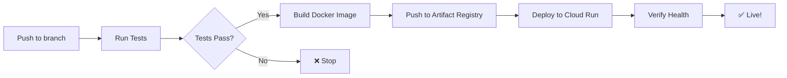

# Continuous Deployment (CD) Setup - Complete ✅

**Date**: December 2, 2025  
**Status**: CD pipeline configured, awaiting secrets setup

---

## What Was Done

### 1. ✅ GitHub Actions Workflow Enhanced

**File**: `.github/workflows/test.yml`

Added a new `deploy` job that:
- **Runs after** all tests pass (unit, integration, code quality)
- **Triggers on** push to `replace-modal-with-google-cloud` branch (not PRs)
- **Does**:
  1. Authenticates to GCP using service account key
  2. Builds Docker image and tags with both `latest` and commit SHA
  3. Pushes to Artifact Registry
  4. Deploys to Cloud Run with proper configuration
  5. Verifies deployment health via `/api/health` endpoint
- **Takes**: ~3-4 minutes

### 2. ✅ Setup Script Created

**File**: `scripts/setup-cd.sh`

Automated script that:
- Creates GCP service account (`github-actions-deployer`)
- Grants necessary IAM roles:
  - `roles/run.admin` - Deploy to Cloud Run
  - `roles/iam.serviceAccountUser` - Act as Cloud Run service account
  - `roles/artifactregistry.writer` - Push images to Artifact Registry
- Generates service account key JSON
- Copies key to clipboard (macOS)
- Provides step-by-step instructions

**Usage**:
```bash
./scripts/setup-cd.sh
```

### 3. ✅ Comprehensive Documentation

**File**: `docs/03-deployment/CD-SETUP.md`

Complete guide covering:
- Prerequisites and service account setup
- GitHub secrets configuration (`GCP_SA_KEY`, `ADMIN_TOKENS`)
- How the CD pipeline works
- Monitoring deployments
- Troubleshooting common issues
- Security best practices
- Alternative: Workload Identity Federation

### 4. ✅ Updated GitHub Actions README

**File**: `.github/README.md`

Now includes:
- CD deployment job documentation
- Required GitHub secrets
- Setup instructions with link to detailed guide
- Updated total runtime estimates

---

## How It Works

### Current Flow (After Setup)



**Time**: 7-8 minutes from push to live deployment

### What Gets Deployed

- **Latest code** from `replace-modal-with-google-cloud` branch
- **Docker image** tagged with both:
  - `latest` (always points to most recent)
  - `<commit-sha>` (immutable, allows rollback)
- **Environment variables** set automatically:
  - `GOOGLE_CLOUD_PROJECT=nomadkaraoke`
  - `GCS_BUCKET_NAME=nomadkaraoke-uploads`
  - `FIRESTORE_COLLECTION=jobs`
  - `ENVIRONMENT=production`
  - `ADMIN_TOKENS=<from GitHub secret>`
- **Resources**:
  - 2 vCPUs, 2GB RAM
  - Scale 0-10 instances
  - 15 minute timeout

---

## Next Steps to Activate

### 1. Run Setup Script

```bash
cd /Users/andrew/Projects/karaoke-gen
./scripts/setup-cd.sh
```

This will:
- Create the service account
- Grant necessary permissions
- Generate the key JSON
- Copy it to your clipboard
- Display the key content

### 2. Add GitHub Secrets

Go to: https://github.com/nomadkaraoke/karaoke-gen/settings/secrets/actions

**Add Secret 1: `GCP_SA_KEY`**
- Name: `GCP_SA_KEY`
- Value: Paste the entire JSON key content (from clipboard or terminal output)

**Add Secret 2: `ADMIN_TOKENS`**
- Name: `ADMIN_TOKENS`
- Value: Your comma-separated admin tokens (e.g., `token1,token2`)

### 3. Test the CD Pipeline

```bash
# Make any small change (or empty commit)
git commit --allow-empty -m "Test CD pipeline"
git push origin replace-modal-with-google-cloud

# Watch the deployment
gh run watch
```

### 4. Verify Deployment

```bash
# Check service is live
curl https://api.nomadkaraoke.com/api/health

# Should return: {"status":"healthy","timestamp":"..."}
```

---

## Benefits

### Before (Manual Deployment)
- ❌ Manual `gcloud builds submit` commands
- ❌ Potential to deploy broken code
- ❌ No automated testing before deployment
- ❌ Deployment takes ~10 minutes of manual work
- ❌ Risk of forgetting to set environment variables

### After (Automated CD)
- ✅ Automatic deployment on every push
- ✅ Only deploys if all tests pass
- ✅ 73 tests validate code before deployment
- ✅ Zero manual intervention needed
- ✅ Consistent, repeatable deployments
- ✅ Fast feedback loop (~7 minutes)
- ✅ Automatic health verification

---

## Confidence Level

Once the secrets are set up, we can have **very high confidence** that:

1. **Code works before deployment**: 73 tests must pass
   - 62 unit tests (models, services, business logic)
   - 11 integration tests (real Firestore + GCS)
   - Code quality checks

2. **Deployment is consistent**: Same process every time
   - Docker image built from exact commit
   - Environment variables set correctly
   - Health check verifies service is responding

3. **Rollback is easy**: If something breaks
   - Image tagged with commit SHA
   - Can redeploy any previous version in ~2 minutes
   - Cloud Run keeps revision history

4. **No manual errors**: Automation eliminates
   - Forgotten environment variables
   - Wrong image tags
   - Configuration drift
   - Human mistakes

---

## Monitoring the CD Pipeline

### GitHub Actions UI
https://github.com/nomadkaraoke/karaoke-gen/actions

View:
- All workflow runs
- Individual job logs
- Test results
- Deployment status

### Command Line

```bash
# List recent runs
gh run list --branch replace-modal-with-google-cloud --limit 5

# Watch current run
gh run watch

# View specific run
gh run view <run_id>

# View logs
gh run view <run_id> --log
```

### Cloud Run

```bash
# Get current revision
gcloud run services describe karaoke-backend --region=us-central1

# View deployment logs
gcloud logging read "resource.type=cloud_run_revision AND resource.labels.service_name=karaoke-backend" \
  --limit 50 --format json
```

---

## Security Notes

### Service Account Key
- ⚠️ **Keep it secret**: The JSON key provides full deployment access
- ✅ **Store in GitHub secrets**: Never commit to git
- ✅ **Delete local copy**: After copying to GitHub: `rm ~/github-actions-key.json`
- ✅ **Rotate regularly**: Create new key every 90 days, delete old

### Admin Tokens
- ✅ **Use strong tokens**: Minimum 32 characters, random
- ✅ **Store in GitHub secrets**: Never in code or environment files
- ✅ **Rotate regularly**: Change tokens periodically
- ✅ **Different per environment**: Production vs staging vs dev

### Future: Workload Identity Federation
- **More secure**: No long-lived keys
- **Automatic**: Credentials managed by Google
- **Recommended**: For production workloads
- **Migration**: See docs/03-deployment/CD-SETUP.md

---

## Testing Strategy Summary

The CD pipeline ensures quality through a comprehensive test suite:

### Layer 1: Unit Tests (62 tests, ~30s)
✅ Models - Pydantic validation  
✅ Services - Business logic with mocked dependencies  
✅ JobManager - Job lifecycle operations  
✅ File Upload - Request handling and validation

### Layer 2: Integration Tests (11 tests, ~2min)
✅ Real Firestore emulator - Document CRUD operations  
✅ Real GCS emulator - File upload/download  
✅ End-to-end workflows - Job lifecycle  
✅ Internal API endpoints - Worker coordination

### Layer 3: Code Quality (~20s)
✅ Python syntax validation  
✅ Import checks  
✅ Basic linting

**Total**: 73 automated tests ensuring code quality before deployment

---

## Related Documentation

- [CD Setup Guide](../03-deployment/CD-SETUP.md) - Detailed setup instructions
- [GitHub Actions README](../../.github/README.md) - CI/CD overview
- [Emulator Testing](../03-deployment/EMULATOR-TESTING.md) - Integration test details
- [Observability Guide](../03-deployment/OBSERVABILITY-GUIDE.md) - Monitoring & debugging
- [Deployment Status](./DEPLOYMENT-STATUS.md) - Current deployment state

---

## Summary

✅ **CD pipeline fully configured**  
✅ **Comprehensive testing in place**  
✅ **Documentation complete**  
✅ **Setup script ready**  

**Remaining**: Add GitHub secrets (`GCP_SA_KEY`, `ADMIN_TOKENS`)  
**Time to activate**: ~5 minutes

Once activated, every push to `replace-modal-with-google-cloud` will:
1. Run all tests (~3 min)
2. Build and deploy (~4 min)
3. Verify health (~10 sec)
4. ✅ Be live on https://api.nomadkaraoke.com

**Result**: True continuous deployment with high confidence! 🚀

