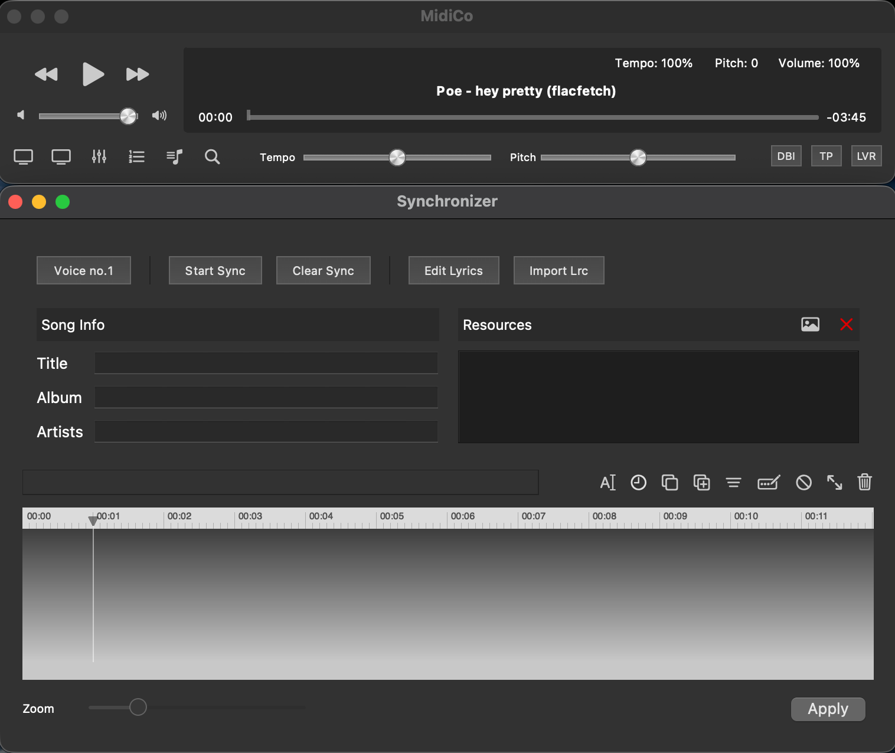
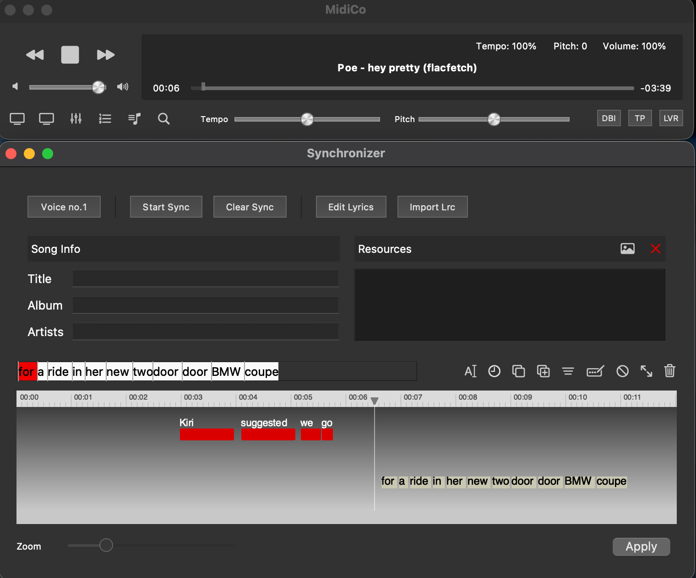
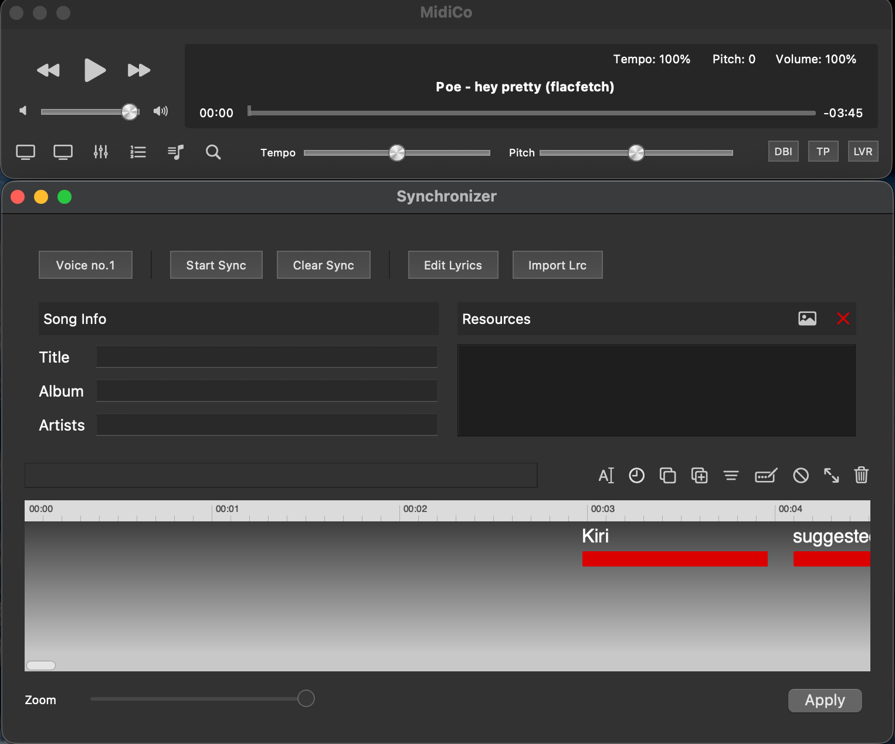
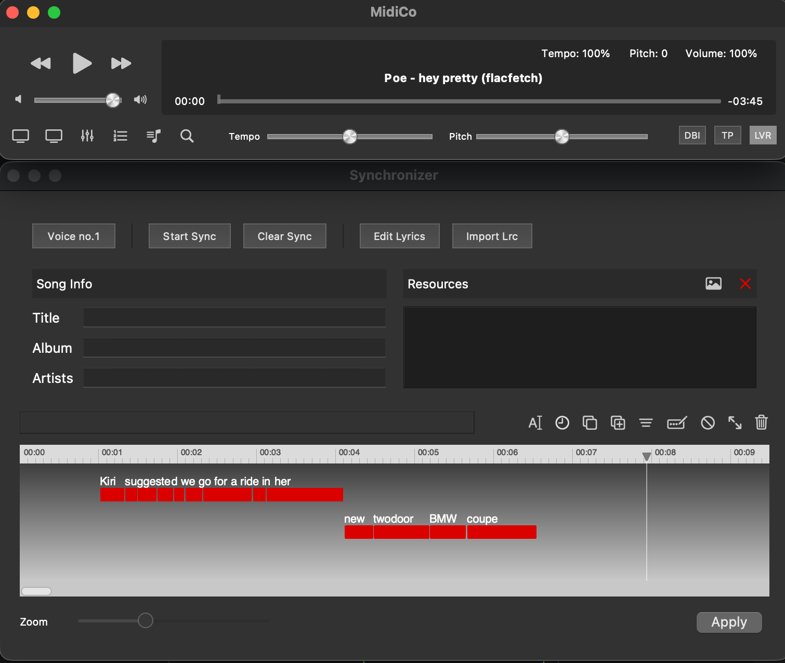
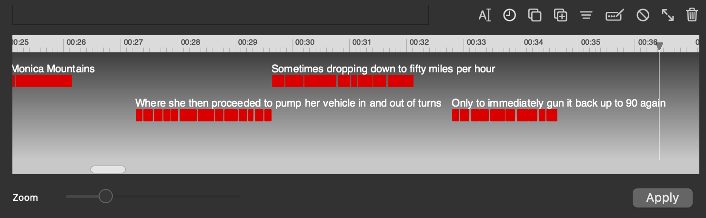
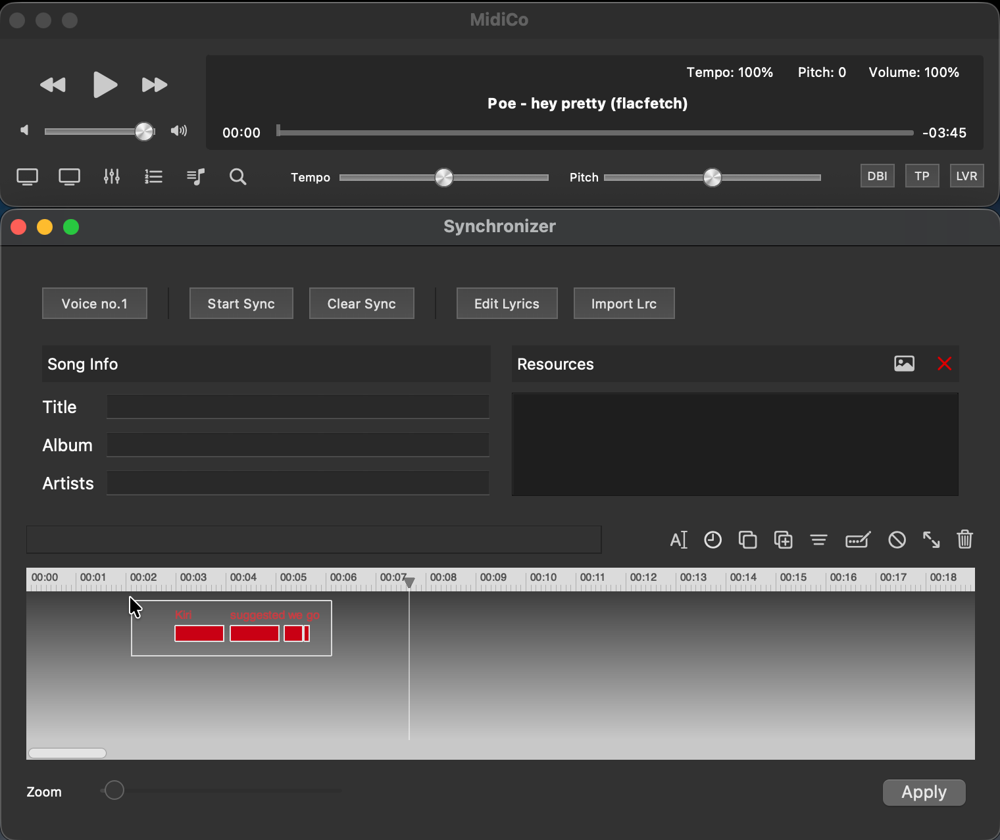
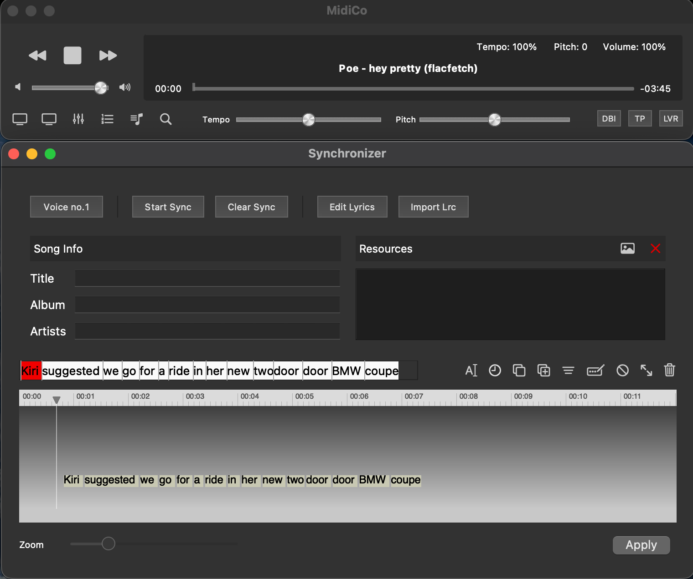
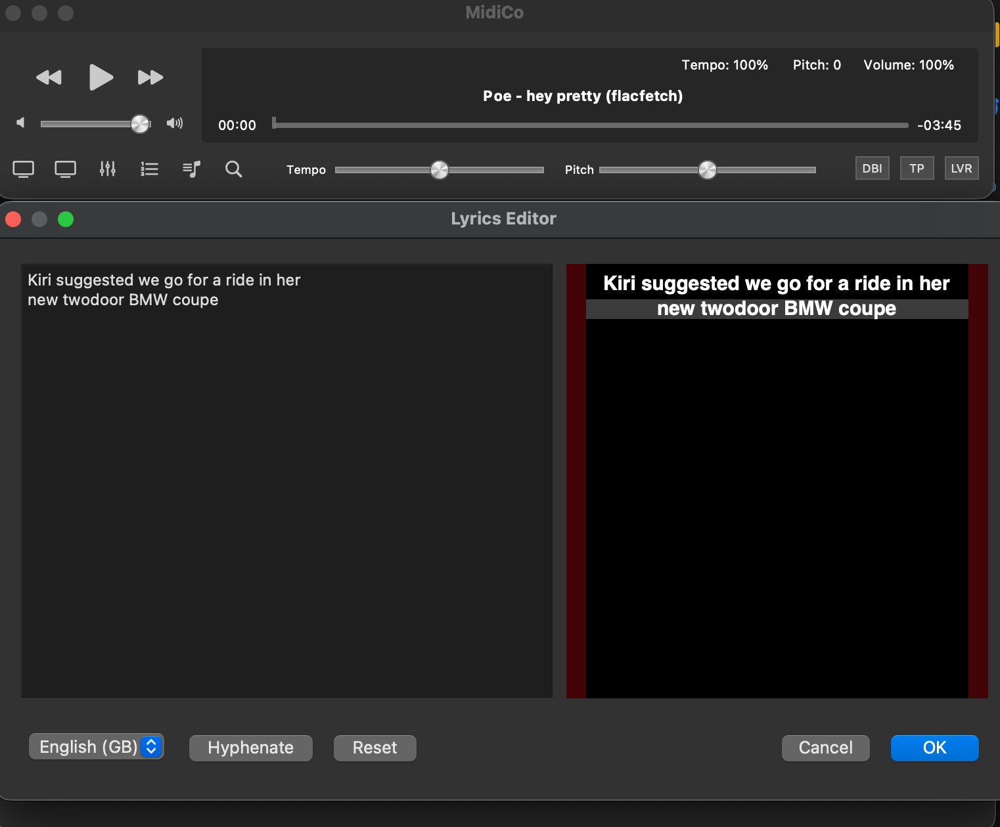

# MidiCo Synchronizer Reference

This document provides a detailed reference for replicating the MidiCo Synchronizer user experience in our Nomad Karaoke lyrics review UI. The MidiCo Synchronizer is a native macOS application that provides a polished, intuitive interface for manually syncing lyrics to audio.

## Problem Statement

Sometimes transcribed lyrics are correct and start well-synced, but progressively drift out of sync towards the second half of the song. We need an efficient way to fix timing for multiple segments without having to re-sync everything from scratch.

## Overview of MidiCo Interface

MidiCo consists of two windows:
1. **Main Audio Player Window** - Controls audio playback
2. **Synchronizer Window** - Timeline-based lyrics sync interface

---

## 1. Audio Player Integration

The main MidiCo window provides an audio player that stays synchronized with the Synchronizer:

- **Play/Pause/Stop buttons** - Standard playback controls
- **Rewind/Fast-forward buttons** - Skip through the track
- **Progress slider** - Shows current position (00:00 format) and remaining time (-03:45 format)
- **Volume slider** - Control audio volume
- **Tempo/Pitch sliders** - Adjust playback speed and pitch (useful for difficult sections)

**Key behavior:** The playhead position is always synced between the audio player and the Synchronizer timeline.

---

## 2. Synchronizer Primary View

The Synchronizer window contains the main timeline interface for syncing lyrics.

### 2.1 Top Control Buttons

Four main control buttons at the top:

| Button | Function |
|--------|----------|
| **Voice no.1** | Select which vocal track to sync (for multi-voice karaoke) |
| **Start Sync** | Begin sync mode - starts audio, shows upcoming words, listens for spacebar |
| **Clear Sync** | Delete all sync data, reset to unsynced state |
| **Edit Lyrics** | Open modal to edit the lyrics text directly |
| **Import Lrc** | Import timing data from an LRC file |

### 2.2 Timeline View

The main rectangular timeline area is the core of the interface.

#### Time Bar (Top Strip)
- Thin bar at the top showing time in `MM:SS` format
- Small tick marks for decisecond precision
- Clicking anywhere on the time bar sets the playhead position (without changing playback state)

#### Playhead Marker
- Small arrow/triangle indicator in the time bar
- White vertical line spanning the full height of the timeline
- Shows current playback position
- Synced with the audio player position

#### Timeline Background
- Light gray gradient background
- **Clicking on the background deselects any selected words**
- **Click-drag creates a selection rectangle** for selecting multiple word blocks

#### Zoom Control
- Horizontal slider below the timeline labeled "Zoom"
- Smooth continuous zoom (approximately 50 notches)
- **Most zoomed in:** ~4.5 seconds visible edge-to-edge
- **Most zoomed out:** ~24 seconds visible edge-to-edge
- Smooth, responsive zooming is critical for fast songs

#### Horizontal Scrolling
- Timeline scrolls horizontally to show different parts of the song
- Small horizontal scrollbar at the bottom of the timeline area
- During sync mode, the timeline auto-scrolls to follow the playhead

### 2.3 Word Blocks

Synced words appear as **red rectangular blocks** on the timeline:

- Each block shows the word text above the red bar
- If word text is too long to fit the width of the red bar, the alignment with the red blocks becomes "best effort". Words don't overlap, they're all readable above the red bars for that segment
- Block width corresponds to the word's duration
- Block horizontal position corresponds to the word's start time

#### Two-Level Word Layout (Alternating Segments)

Segments alternate between two vertical positions on the timeline. Each consecutive segment (in time order) is placed on the opposite level from the previous one:

- **Level 0 (top)**: 1st, 3rd, 5th, 7th... segments
- **Level 1 (bottom)**: 2nd, 4th, 6th, 8th... segments

This alternating layout is critical because:

1. **Text never overlaps between consecutive segments** - Since each segment is on a different level, the text labels above the red blocks from one segment won't collide with text from the next segment, even if the text extends past its block width.

2. **All words remain readable** - Text is allowed to extend horizontally beyond the red block boundaries. Because consecutive segments are always on different vertical levels, this extended text doesn't overlap with adjacent segments.

In the example above, notice how:
- "Monica Mountains" (level 0) has text that extends beyond its block
- "Where she then proceeded to pump her vehicle in and out of turns" (level 1) is on a different vertical level
- "Sometimes dropping down to fifty miles per hour" (level 0) returns to the top level
- "Only to immediately gun it back up to 90 again" (level 1) is back on the bottom level

This simple alternating pattern ensures that even long segment text remains fully readable without truncation.

**Edge case:** Overlap can still occur in rare situations - if one segment's text is extremely long AND the segment two positions later (on the same level) is very short/early. But this is uncommon in practice.

#### Word Block Selection

- **Single click** on a word block: Selects that block (shown with white 1px border)
- **Click-drag on background**: Creates selection rectangle to select multiple blocks

#### Word Block Manipulation (Resize & Drag)

Selected word blocks can be manipulated directly on the timeline:

##### Resizing Word Blocks (Change Duration)

When a word block is selected and you hover over it, a **small white dot/handle** appears just inside the right edge of the block. This resize handle allows you to change the word's duration:

1. Select a word block (single click)
2. Hover over the selected block to reveal the resize handle (white dot on right edge)
3. Click and drag the handle left/right to shorten/lengthen the word's duration
4. The word's end time changes; start time remains fixed

This is essential for fine-tuning word durations after initial sync, especially for:
- Words that were synced too long or too short
- Adjusting timing to better match the audio
- Creating smoother transitions between words

##### Dragging Word Blocks (Change Position)

Selected word blocks can be dragged horizontally to change their position in time:

**Single word:**
1. Select a word block
2. Click and drag anywhere on the block (not on the resize handle)
3. The entire word moves earlier/later in time (both start and end times shift)

**Multiple words:**
1. Drag-select multiple word blocks (or Ctrl/Cmd+click to add to selection)
2. Click and drag any of the selected blocks
3. **All selected blocks move together**, maintaining their relative timing

This is particularly useful for:
- Shifting an entire segment earlier or later when it's consistently off
- Adjusting groups of words that were synced correctly relative to each other but offset from the audio
- Fine-tuning timing without having to re-sync

**Example workflow:** If a segment of 10 words all come in 0.2 seconds too late:
1. Drag-select all 10 word blocks
2. Drag them 0.2 seconds earlier
3. All words maintain their relative timing but are now properly aligned with the audio

### 2.4 Upcoming Words Display

During sync mode, unsynced words appear in **two locations**:

1. **Fixed position above time bar** (left side): Shows upcoming words as red/white blocks in a horizontal row. The next word to sync is highlighted in red, subsequent words in white.

2. **On the timeline, right of playhead**: Same words appear starting from the playhead position and extending to the right, with a pale yellow background and black text, moving along with the playhead during playback.

This dual display makes it easy to:
- See what's coming next (fixed position - easy to read while focused on timing)
- See where words will land on the timeline relative to already-synced words

---

## 3. Action Buttons (Icon Toolbar)

A row of small icon-only buttons appears above the timeline. Key buttons we need:

### Essential Buttons

| Icon | Tooltip | Function |
|------|---------|----------|
| **Rectangle with Pencil** | Split, spell or edit selected word | Opens popup to edit a single word. Useful for typos. Entering multiple space-separated words splits the selected word while preserving timing. |
| **No entry symbol** | Unsynchronize from cursor position | All word blocks **after** the current playhead position are reset to unsynced state. Critical for fixing drift in later parts of a song. |
| **Trash** | Delete selected | Deletes selected word(s) entirely. Useful for removing backing vocals or nonsense words. |

### Typical Workflow for Deleting Unwanted Words

1. Tap spacebar to sync the unwanted words (so they appear on timeline)
2. Stop playback
3. Click-drag to select the unwanted word blocks
4. Click trash icon to delete
5. Click Start Sync to resume syncing from where you left off

---

## 4. Sync Mode Operation

### Starting Sync

1. Click **Start Sync** button
2. Audio begins playing from current playhead position
3. Upcoming unsynced words appear in both display locations
4. System begins listening for spacebar input

### Spacebar Timing

Two input modes:

**Tap (press and release quickly):**
- Sets the **start time** of the next unsynced word to the current playhead position
- The word's **end time** is set when the following word is synced
- If gap between words > 1 second, previous word gets default 1 second duration

**Press-hold:**
- Hold spacebar down when word starts
- Release when word ends
- Sets both start and end times explicitly

### Stopping Sync

- Click the **Stop** button (replaces Play when in sync mode)
- Or click **Start Sync** again to toggle off
- Sync progress is preserved

---

## 5. Edit Lyrics Modal

Accessed via the **Edit Lyrics** button. Provides:

- **Left panel**: Plain text editor with all lyrics, newlines separate segments
- **Right panel**: Preview of how lyrics will appear (karaoke style rendering)
- **Language selector**: For hyphenation support
- **Hyphenate button**: Auto-hyphenate words for syllable-level sync
- **Reset button**: Revert to original lyrics
- **Cancel/OK buttons**: Discard or apply changes

### Important Behavior

Editing lyrics when there are already synced timestamps **usually messes up the syncs**. Users typically need to Clear Sync and start over after editing lyrics.

---

## 6. Apply Button

The **Apply** button in the bottom-right corner is critical:

- Changes made in the Synchronizer are **not saved** until Apply is clicked
- This allows experimenting without fear of losing work
- If sync goes badly wrong, user can close the Synchronizer without applying changes
- Provides a safe "sandbox" for sync work

---

## 7. Performance Requirements

The entire interface must be:

- **Smooth and responsive** - No lag or stutter during playback
- **Low latency** - Spacebar input must register with sub-100ms precision
- **Efficient** - No unnecessary computation during sync (user is focused on timing)
- **Native-app feel** - As expected from a macOS application

Since we're dealing with sub-second time precision for synced lyrics, performance is critical.

---

## 8. Implementation Notes for Our App

### Entry Point: "Edit All" Button

The current "Edit All" button should show a choice:
1. **Replace all lyrics** - Shows the existing paste box flow (for completely new lyrics)
2. **Re-sync existing lyrics** - Goes directly to the new Synchronizer view with all existing words/segments plotted on the timeline

This preserves existing sync data while allowing re-sync of later portions.

### Key Features to Implement

1. **Timeline with word blocks showing existing sync data**
2. **Playhead synced with audio player**
3. **Zoom slider (4.5s to 24s range)**
4. **Horizontal scrolling**
5. **Two-level word block layout**
6. **Start Sync mode with spacebar capture**
7. **Upcoming words display (fixed + timeline)**
8. **"Unsynchronize from cursor" - critical for fixing drift**
9. **Word selection (single click + drag-select)**
10. **Delete selected words**
11. **Edit single word popup**
12. **Apply/Cancel for safe experimentation**

### Fixing Timing Drift (Primary Use Case)

The main workflow for fixing drift:

1. Open Synchronizer (with existing sync data loaded)
2. Play audio to find where sync starts drifting
3. Position playhead at last correctly-synced word
4. Click "Unsynchronize from cursor position"
5. Click "Start Sync" to resume syncing from that point
6. Tap spacebar to re-sync the remaining words
7. Click "Apply" when done

This workflow allows keeping good sync data while fixing only the problematic portion.

---

## Screenshots Reference

All screenshots are located in: `docs/midico-sync-screenshots/`

| Filename | Description |
|----------|-------------|
| `MidiCo-Synchronizer-2025-12-18-Empty-Timeline-Before-Any-Words-Synced.png` | Initial state with empty timeline |
| `MidiCo-Synchronizer-2025-12-18-Start-Sync-Showing-Upcoming-Words.png` | Sync mode started, showing upcoming words in both locations |
| `MidiCo-Synchronizer-2025-12-18-During-Sync-Showing-Synced-And-Upcoming-Words.png` | Mid-sync showing both synced blocks and upcoming words |
| `MidiCo-Synchronizer-2025-12-18-During-Sync-Showing-Two-Levels-Word-Blocks.png` | Demonstration of two-level word block layout |
| `MidiCo-Synchronizer-2025-12-18-During-Sync-Showing-Max-Zoom-Level.png` | Maximum zoom level (~4.5 seconds visible) |
| `MidiCo-Synchronizer-2025-12-18-Click-Drag-Word-Selection.png` | Selection rectangle for multi-word selection |
| `MidiCo-Synchronizer-2025-12-18-Lyrics-Editor-Modal.png` | Edit Lyrics modal dialog |
| `MidiCo-Synchronizer-2025-12-18-Timeline-With-Non-Overlapping-Segments.png` | Shows alternating segment levels with long text that doesn't overlap |
